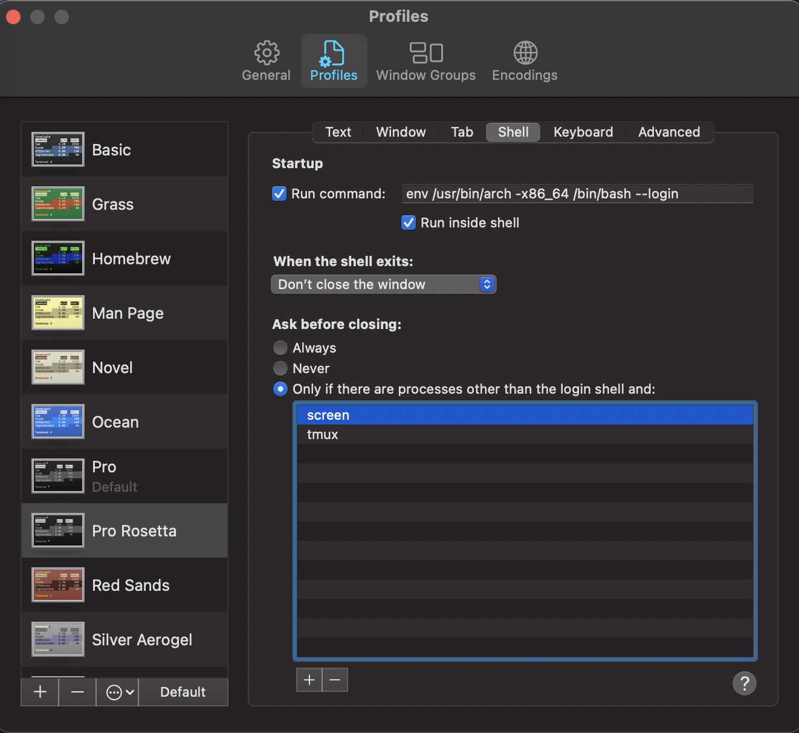

This repo includes snippets and helpful things to use a Apple silicon Mac. 

### Running terminal commands through Rosetta 2

This is specially useful to run shell scripts where there is no execution
binary to tell "this is the arch you should be using."

One can invoke any command in bash through Rosetta 2 with the `arch` command to invoke bash as it was running in an x86 system:
```
$ arch -x86_64 /bin/bash "echo this is running in through Rosetta 2"
```

### Installing Brew with Rosetta 2

We prepend `arch` to the usual call to install brew

```
$ arch -x86_64 /bin/bash -c "$(curl -fsSL https://raw.githubusercontent.com/Homebrew/install/HEAD/install.sh)"
```

### Setting up a terminal profiles that will run everything through Rosetta 2

- Take your favorite profile in Terminal and duplicate it. Open the profiles 
tab in the  preferences menu in the terminal app, select your profile, click on
the "three dots in a circle" below, and click `Duplicate profile`. Then name it
as you prefer, in my case `Pro Rosetta`.


- Edit your new profile to run its shell with Rosetta 2. In the same profiles
tab as above, select the new profile (`Pro Rosetta` in the example), select
the "Shell" tab, check "Run command", and add:
```
env /usr/bin/arch -x86_64 /bin/bash --login
```
I use bash as my default, shell, but if you use `zsh` you would add the
following instead:
```
env /usr/bin/arch -x86_64 /bin/zsh --login
```


